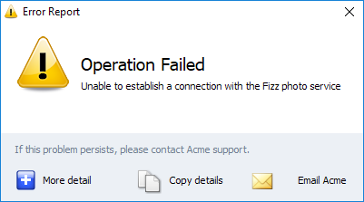
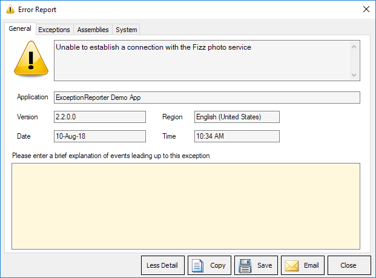
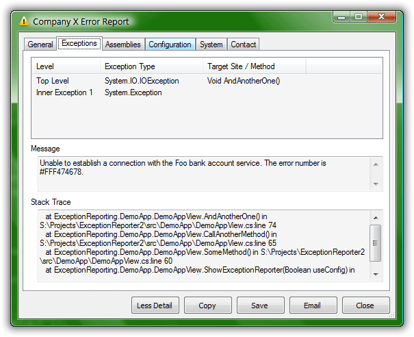

# Social-Office-Error-Reporting


## Whats New?
* Support for .net 4.8 for lasted framework improvements.


## Philosophy of Javier Cañon
* KISS by design and programming. An acronym for "keep it simple, stupid" or "keep it stupid simple", is a design principle. The KISS principle states that most systems work best if they are kept simple rather than made complicated; therefore, simplicity should be a key goal in design, and unnecessary complexity should be avoided. Variations on the phrase include: "Keep it simple, silly", "keep it short and simple", "keep it simple and straightforward", "keep it small and simple", or "keep it stupid simple".

* Select the best tools for the job, use tools that take less time to finish the job.
* Productivity over complexity and avoid unnecessary complexity for elegant or beauty code.

* Computers are machines, more powerful every year, give them hard work, concentrate on being productive.

* Often people, especially computer engineers, focus on the machines. They think, "By doing this, the machine will run fast. By doing this, the machine will run more effectively. By doing this, the machine will something something something." They are focusing on machines. But in fact we need to focus on humans, on how humans care about doing programming or operating the application of the machines. We are the masters. They are the slaves. **[Yukihiro Matsumoto]**.

## Requeriments ##

* Windows 8.1, 10.
* .Net Framework 4.8.


## Installing


## Releases
> For lasted release download from [Releases Menu](https://github.com/JavierCanon/Social-Office-Error-Reporting/releases)
- Please Read [RELEASE](RELEASE.md) for details.

## Report Issues, Bugs
- Please first search for the issue and if not found then report it.
> [Issues Menu](https://github.com/JavierCanon/Social-Office-Error-Reporting/issues)

## Roadmap
- Please Read [ROADMAP](ROADMAP.md) for details.

## Change Log
- Please Read [CHANGE LOG](CHANGELOG.md) for details.

## Contributing
- Please Read the [Contributing Guidelines](CONTRIBUTING.md) for details.

## Getting Started

These instructions will get you a copy of the project 
up and running on your local machine for development and testing purposes.
See deployment for notes on how to deploy the project on a live system.


### Prerequisites

What things you need to install the software and how to install them

```
Give examples
```

### Installing

A step by step series of examples that tell you how to get a development 
env running

Say what the step will be

```
Give the example
```

And repeat

```
until finished
```

End with an example of getting some data out of the system 
or using it for a little demo


## Running the tests

Explain how to run the automated tests for this system


### Break down into end to end tests

Explain what these tests test and why

```
Give an example
```

### And coding style tests

Explain what these tests test and why

```
Give an example
```

## Deployment

Add additional notes about how to deploy this on a live system


## Built With

* [Dropwizard](http://www.dropwizard.io/1.0.2/docs/) - The web framework used
* [Maven](https://maven.apache.org/) - Dependency Management
* [ROME](https://rometools.github.io/rome/) - Used to generate RSS Feeds

## Contributing

Please read [CONTRIBUTING.md](https://gist.github.com/PurpleBooth/b24679402957c63ec426) for details on our code of conduct, and the process for submitting pull requests to us.

## Versioning

We use [SemVer](http://semver.org/) for versioning. For the versions available, see the [tags on this repository](https://github.com/your/project/tags). 

## Authors

* **Billie Thompson** - *Initial work* - [PurpleBooth](https://github.com/PurpleBooth)

See also the list of [contributors](https://github.com/your/project/contributors) who participated in this project.

## License

This project is licensed under the MIT License - see the [LICENSE.md](LICENSE.md) file for details

## Acknowledgments

* Hat tip to anyone whose code was used
* Inspiration
* etc


## This is a Fork From ExceptionReporter.NET

## How it Looks

If you choose to show a dialog (reports can also be sent silently) there are 2 *modes* - *Less Detail* and *More Detail*

### **Less Detail** mode


### **More Detail** mode


#### Interface Configuration Options
In the next screenshot, we have an example of some customization that can be made with *configuration*. 
There are no images on the buttons,
the window title is customised and an extra Tab (_Contact_) is visible



The buttons for *More detail* and *Less Detail* allow the user to switch between these modes.

## How it works

The Exception Reporter is invoked manually or by setting up it's invocation on a Windows Error event, where it's basically passed the root Exception -
see [Sample Code Usage](https://github.com/PandaWood/Exception-Reporter/wiki/Sample-Usage)

The report is either sent silently or you can choose to show a dialog which is populated with the exception and certain system details.
A screenshot is also taken (jpeg, multiple screens if present) and you can add file attachments to be sent (if using email as the method of sending).

The ultimate goal is the developer receiving a formatted exception report - see
[Creating and Sending a Report](https://github.com/PandaWood/Exception-Reporter/wiki/Creating-and-Sending-a-Report)


## Some Important Features

- Support for inner exceptions and passing multiple exceptions (ie a list of exceptions)
- Support for generating a report without showing a dialog (sending silently)
- Support for sending a report to a RESTful API (WebService)
- Attach additional files to an email (automatically compressed into a single zip file before being attached) - useful for including any log/config files etc to help with diagnosis
- Support for using the user's installed email client (SimpleMAPI) - as well as an SMTP mail server (or WebService)
- The solution includes a Demo App for testing config and sending reports via Email/WebService
- The solution also includes a .NET Core REST/WebService project to demonstrate processing ExceptionReporter.NET reports (it's also configured to run on F5 along with the WinForms Demo and starts listening for reports immediately)
- The "Report" which is sent is plain text and includes exception stack traces, various related data and important system information (using WMI) such as CPU, memory, Windows versions as well as a list of all the assemblies (with versions) being used by the current executable (see example report below)

```
-----------------------------
[General Info]

Application: ExceptionReporter Demo App
Version:     2.2.1
Region:      English (Australia)
Machine:     PANDAMAN
User:        JohnGruber
Date: 30/05/2017
Time: 12:40 AM

User Explanation:

JohnGruber said "I just pressed Connect and this happened"
-----------------------------
 
[Exception Info 1]

Top-level Exception
Type:        System.IO.IOException
Message:     Unable to establish a connection with the Foo bank account service. The error number is #FFF474678.
Source:      WinFormsDemoApp
Stack Trace: at WinFormsDemoApp.DemoAppView.AndAnotherOne() in Z:\MyProjects\ExceptionReporter\src\WinFormsDemoApp\DemoAppView.cs:line 110
    at WinFormsDemoApp.DemoAppView.CallAnotherMethod() in Z:\MyProjects\ExceptionReporter\src\WinFormsDemoApp\DemoAppView.cs:line 101
    at WinFormsDemoApp.DemoAppView.SomeMethod() in Z:\MyProjects\ExceptionReporter\src\WinFormsDemoApp\DemoAppView.cs:line 96
    at WinFormsDemoApp.DemoAppView.ShowExceptionReporter(Boolean useConfig) in Z:\MyProjects\ExceptionReporter\src\WinFormsDemoApp\DemoAppView.cs:line 81

Inner Exception 1
Type:        System.Exception
Message:     This is an Inner Exception message - with a message that is not too small but perhaps it should be smaller

-----------------------------

[Assembly Info] 
mscorlib, Version=2.0.0.0
System.Windows.Forms, Version=2.0.0.0
System, Version=2.0.0.0
ExceptionReporter.WinForms, Version=2.1.2.0
System.Drawing, Version=2.0.0.0
EO.WebBrowser, Version=16.0.91.0
Esent.Collections, Version=1.9.3.2

[System Info]
Operating System
-Microsoft Windows 7 Enterprise
--CodeSet = 1252
--CSDVersion =
--CurrentTimeZone = 600
--FreePhysicalMemory = 1947848
--OSArchitecture = 32-bit
--OSLanguage = 1033
--ServicePackMajorVersion = 0
--ServicePackMinorVersion = 0
--Version = 6.1.7600

[Machine]
--Manufacturer = Gigabyte Technology Co., Ltd.
--Model = P35-DS3L
--TotalPhysicalMemory = 3756515328
```


## Credits / Authors

- [Peter van der Woude](https://github.com/PandaWood/ExceptionReporter.NET) for Original Project.
- [Manish Ranjan Kumar](https://www.codeproject.com/Members/Manish-Ranjan-Kumar) 
- [Javier Cañon](https://javiercanon.com)

See also the list of [contributors](/AUTHORS.md) who participated in this project.


## Supported by, thanks to 


[Caphyon Advanced Installer](https://www.advancedinstaller.com) 
-- 

 

[Softcanon](https://www.softcanon.com) 
-- 

* [SQL Pretty Printer for SQL Server](http://www.dpriver.com/products/sqlpp/index.php) 
-- 

## License

This project is licensed under the GNU AFFERO GENERAL PUBLIC LICENSE Version 3 - see the [LICENSE.md](/LICENSE.md) file for details.

---
Made with ❤️ by **[Javier Cañon](https://javiercanon.com)**.


